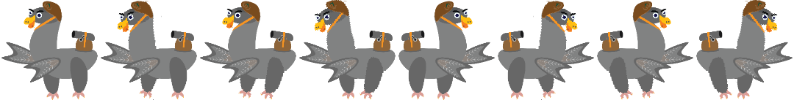
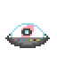
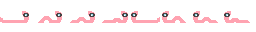
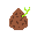
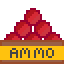

# cc241042_CCL_1
# 🎮 **Peck of Rage** 

> "Peck of Rage", a fast-paced platformer, where you can choose to fight or dodge the enemies. Reach your ship and collect seeds to win.
---

## 🌐 **Play the Game**
[Click here to play the game!](https://your-github-username.github.io/repository-name)

---

## 📸 **Screenshots**

### Main Gameplay:

  
  
*Begining of the game*

---

### Menu and UI:

  
  
*Start Screen*

  
  
*Death Screen*

  
  
*Win Screen*

---

## 🎨 **Spritesheets**
Below are the sprites used to create characters and objects in the game:

### Player Character:

  
  
*Player character animations.*

---

### Enemies and NPCs:

  
  
*Enemy - flying*

  
  
*Enemy - walking*

---

### Collectables:

  
  
*Seed*

  
  
*Ammobox*

  
  
*Power Up*

---

### Platforms:

  
  
*Platform 1*

  
  
*Platform 2*

## ✍️ **Reflection**

### What went well:
- I implemeted most of the features I planned for.
- I created a design style for the game, which suited my inital idea.
- Managed to generate a soundtrack and find free sound effects, that make the game far more enjoyable to play
- The game is hard enough for new players (tested during the CLL on other studens).
- Option to make the game even harder -  beating it without a weapon.

### Challenges:
- First few iterations of gravity consumed many hours an were scraped. I resorted to using the provided template, so I wouldn't waste more time.
- Making the game ready for "release", and final bug-fixes was a challange, since it required a lot of testing and changes in code (Implematation of reseting the game after losing a life, after dying or after winning). Each of this resets has some differences.

### Lessons Learned:
- I've learned how to create a game. Utilizing object oriented programing help a lot, which was my frist time using it apart from lessons.
- I've learned how to create animations using spritesheets. I also created almost every asset in the game (apart from lava), which taught me how to do pixel art.
- I've learned a lot from my mistakes, especially wasting a lot of time on first few prototypes acctually hellped me, because later I didn't make same mistakes.
